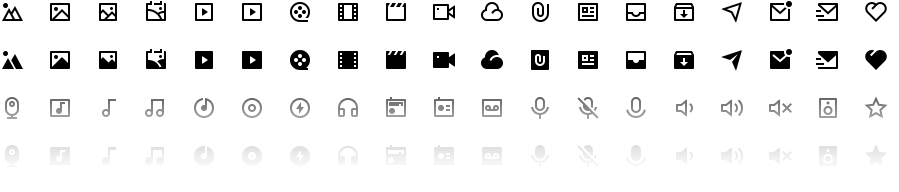

[](https://remixicon.com)

[](https://www.npmjs.com/package/remixicon)
[](https://www.npmjs.com/package/remixicon)
[](https://www.jsdelivr.com/package/npm/remixicon)
[](https://remixicon.com/support-us)

[](https://go.streamlinehq.com/remix-github)

[English](./README.md) | 简体中文

Remix Icon 是一套面向设计师和开发者的开源图标库。我们在设计之初将图标风格定义为中性风格，以便适用于各种用户群的项目。与拼凑混搭的图标库不同，Remix Icon 的每一枚图标都是由设计师按照统一规范精心绘制的，并确保每一枚图标在拥有完美像素对齐的基础上风格一致且简洁易读。图标以 24x24 网格为基准，分为“线性图标”和“面型图标”两种风格。所有的图标均可免费用于个人项目和商业项目，Enjoy it~

[](https://remixicon.com)
前往官网查看整套图标库 [remixicon.com](https://remixicon.com).

## 使用说明

### 基本用法

直接在[remixicon.com](https://remixicon.com)点击您想要的图标, 在打开的图标窗口中可以以 PNG 或者 SVG 格式进行下载，也可以直接复制 SVG 代码。

设计师小伙伴可以直接点击 `Copy SVG` 之后在 UI 设计软件中直接粘贴矢量图形，使用起来像插件一样简单便捷。

> 我们建议设计师小伙伴在需要使用某些图标的时候通过官网搜索下载使用，而不是将一整套图标全部下载放在本地文件夹中进行管理；官网的搜索栏可以帮助您快速定位您想要的图标，而且支持中文关键词搜索，这相比本地文件夹管理图标效率要高很多；最重要的是，官网的图标会持续更新。
> 在官网点击 Copy SVG 之后，可以在 Sketch 中直接粘贴矢量图标，也可以在代码文本编辑器中粘贴 SVG 代码。
>
> `Copy SVG` 功能目前支持在 Sketch、Figma、Adobe XD、Adobe Illustrator、Affinity Designer、Affinity Photo 软件中直接粘贴矢量图形。

SVG 本身也是一种图片格式，所以您可以像使用其他格式（如 JPG、PNG）的图片文件一样使用 SVG 文件，例如直接引入的方式：

```html

```

### Webfont 用法

> **Note:** Webfont 支持 npm 安装引入、CDN 引入或者手动下载的方式引入到项目当中，三选一即可。

#### 安装引入

> **Note:** 如果您打算通过 CDN 的方式使用 Remix Icon，可以跳过安装引入这一步。

```
npm install remixicon --save
```

```
import 'remixicon/fonts/remixicon.css'
```

> 入口文件引入 CSS

#### CDN 引入

如果不打算通过安装的方式使用，可以直接复制下面这行代码到您 HTML 文档的 &lt;head&gt; 标签中，这样就完成了 CDN 方式的图标引入，简单快捷，推荐方式。

```html
<link
    href="https://cdn.jsdelivr.net/npm/remixicon@4.4.0/fonts/remixicon.css"
    rel="stylesheet"
/>
```

> 上面 CDN 链接中的 `@4.4.0` 可以更改为任何我们曾经发布过的历史版本号。

#### 手动下载引入

下载保存[`remixicon.css`](https://cdn.jsdelivr.net/npm/remixicon@2.5.0/fonts/remixicon.css)文件，添加到项目的&lt;head&gt; 标签中即可。

#### 使用

引入 Remix Icon 图标库后，就可以在 web 项目中使用了，只要在使用图标的时候将图标名称作为类名就可以了。类名规则：ri-{name}-{style}

```html
<i class="ri-admin-line"></i>
<i class="ri-admin-fill"></i>
```

> **注意：** 从 v2.0.0 开始，我们修改了 class 名称的前缀，从 `remixicon-` 改为了 `ri-`;

> **Note:** 您可以到官网 [remixicon.com](https://remixicon.com) 查阅图标对应的名称，然后在名称后添加图标风格，`-line` 代表线性风格，`-fill`代表面型风格。

#### 大小

在 `v1.3.1`及以上版本的字体使用方式下，RemixIcon 可以通过 `remixicon.css` 中集成的一些 class 来快捷改变图标的大小。这些 class 使用 `em` 相对大小单位来控制图标尺寸，相对值为图标的父类元素的字体大小值。您也可以通过 `ri-fw` 来使得图标宽度固定，例如在列表场景中使用。class 举例：

```html
<div style="font-size: 24px;">
  <i class="ri-admin-line ri-fw"></i> <!-- fixed width -->
  <i class="ri-admin-line ri-xxs"></i> <!-- 0.5em -->
  <i class="ri-admin-line ri-xs"></i> <!-- 0.75em -->
  <i class="ri-admin-line ri-sm"></i> <!-- 0.875em -->
  <i class="ri-admin-line ri-1x"></i> <!-- 1em -->
  <i class="ri-admin-line ri-lg"></i> <!-- 1.3333em -->
  <i class="ri-admin-line ri-xl"></i> <!-- 1.5em -->
  <i class="ri-admin-line ri-2x"></i> <!-- 2em -->
  <i class="ri-admin-line ri-3x"></i> <!-- 3em -->
  ...
  <i class="ri-admin-line ri-10x"></i> <!-- 10em -->
</div>
```

> 您也可以在 [`remixicon.css`](https://github.com/Remix-Design/RemixIcon/blob/master/fonts/remixicon.css) 中查看到更多的尺寸定义相关信息。

### SVG Sprite 用法

下载 [`remixicon.symbol.svg`](https://cdn.remixicon.com/releases/v2.5.0/remixicon.symbol.svg) 并添加到您的项目目录中，通过 `<use>` 标签来引用图标，通过 css 可以自定义图标的大小和颜色等属性，例如：

```html
<svg class="remix">
    <use xlink:href="存放路径/remixicon.symbol.svg#ri-admin-fill"></use>
</svg>
```

```css
.remix {
    width: 24px;
    height: 24px;
    fill: #333;
}
```

> **Note:** 上面示例中 `#` 后面的 `ri-admin-fill`可以替换为任何 Remix Icon 图标名称，您可以到官网 [remixicon.com](https://remixicon.com) 查阅图标对应的名称，然后在名称后添加图标风格，`-line` 代表线性风格，`-fill` 代表面型风格。`remixicon.symbol.svg`文件默认是无法预览查看的，只能通过 `<use>` 使用之后查看。

### React

#### 安装

```bash
npm install @remixicon/react
# or
yarn add @remixicon/react
# or
pnpm install @remixicon/react
```

#### 使用

```jsx
import { RiHeartFill } from "@remixicon/react";

const MyComponent = () => {
    return (
        <RiHeartFill
            size={36} // 设置大小
            color="red" // 设置颜色
            className="my-icon" // 添加自定义样式名
        />
    );
};
```

### Vue 3

#### 安装

```bash
npm install @remixicon/vue
# or
yarn add @remixicon/vue
# or
pnpm install @remixicon/vue
```

#### 使用

```vue
<script setup lang="ts">
import { RiHeartFill } from "@remixicon/vue";
</script>

<template>
    <RiHeartFill size="36px" color="red" className="my-icon" />
</template>
```

### Figma

[官方插件](https://www.figma.com/community/plugin/1089569154784319246/remixicon)

## 协作共建

> **Note:** 为了保证每一枚图标的质量，现阶段我们还不接受第三方小伙伴绘制的图标。如果您想要向 Remix Icon 贡献自己设计的图标，请创建一个[issue](https://github.com/Remix-Design/remixicon/issues)来提交自己的图标设计，并在 issue 详情中附上自己图标的下载地址，我们会按照 Remix Icon 图标风格规范进行审核，通过后将会添加到图标库中，并在更新日志中署上作者的 ID。如果你对 GitHub 不是很熟悉，不清除 issue 和 pull request 是什么，也可以直接给我们发邮件 `jimmy@remixdesign.cn`，内容表述清楚即可。

### 图标申请

如果图标库中缺少某个适合您业务场景的图标，您可以通过创建[issue](https://github.com/Remix-Design/remixicon/issues)的方式进行申请，issue 标题格式为：“Icon request: <图标名称>”，并完善 issue 模板中的相应信息。感谢您提出图标申请，这也是帮助我们完善图标库的一种协作共建方式。

> RemixIcon 主要聚焦于用户界面类的图标，如果 RemixIcon 没有包含您需要的 logo 类的图标，推荐使用 [Simple Icons](https://github.com/simple-icons/simple-icons)，这是一个优秀的 logo 类图标合集。如果您需要的 logo 经常在 UI 端展示，比如社交媒体类图标，也可以发出申请。

### 图标搜索关键词

目前我们的[图标官网](https://remixicon.com)是通过[`tags.json`](https://github.com/Remix-Design/remixicon/blob/master/tags.json)文件来管理搜索关键词的，目前我们已经为所有图标添加了中文关键词，因此我们可以通过中文对图标进行搜索和定位；但是由于关键词不是很健全，所以用户还是经常无法通过某个特定关键词搜索到已有图标。而目前我们还没有一个很好的自动化策略来穷举每一个图标的关键词，只能通过人肉添加的方式来进行完善，希望用户可以通过提[issue](https://github.com/Remix-Design/remixicon/issues) 或者 pull request 的方式来帮我们一块完善维护 `tags.json`，让搜索功能变得更加好用。

## 相关项目

[RemixIcon-Slides](https://github.com/Remix-Design/RemixIcon-Slides) Remix Icon 的 PPT 版本和 Keynote 版本。

## 协议许可

Remix Icon 是基于 [Apache License Version 2.0](https://github.com/Remix-Design/remixicon/blob/master/License) 开源协议的。请放心使用和分享本图标库，您可以查看协议详情来了解详细的开源策略。如果您能在您的产品介绍中署名 Remix Icon，我们将会非常感激，但这并不是必须的。唯一需要注意的是，您不能二次销售本图标库中的图标，否则我们会进行追究。

## 支持我们

很简单，只需要点一下 GitHub 本项目右上角的小星星就可以了！精神鼓励就是支持我们持续维护本项目的最大动力。请我们喝杯咖啡当然也没问题哈哈~

## 关注我们

我们都是 X / Twitter 上的新人，欢迎关注我们为我们增加一点人气~

官号 - https://x.com/RemixDesignHQ

设计师 - https://x.com/remixdesigner

程序媛 - https://twitter.com/wendygaoyuan
